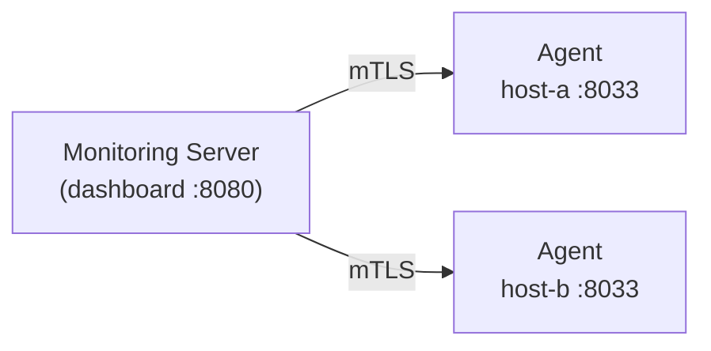

# Church Monitoring

Lightweight monitoring dashboard for church AV infrastructure. A central server pulls status from agents running on each monitored host. Communication is secured with mutual TLS and token-based enrollment.

## Architecture



- **Pull model** — the server fetches status from agents on demand
- **Agents** collect metrics via cron every 5 minutes and cache locally
- **CEC** (TV power/input) checks are triggered from the dashboard, not polled
- **Mutual TLS** — both server and agents present certificates signed by the same CA
- **Token enrollment** — single-use tokens authorize new agents to join

## Prerequisites

- Debian/Ubuntu (tested on Raspberry Pi OS)
- Root access on both server and client machines
- Network connectivity between server and clients

## Server Installation

Run on the machine that will host the monitoring dashboard:

```bash
sudo ./server/install.sh
```

The installer will:

1. Install packages (`apache2`, `openssl`, `jq`)
2. Create a Certificate Authority for mutual TLS
3. Generate a server client certificate
4. Set up the dashboard on port 8080 (configurable with `--port`)
5. Bootstrap the initial admin login account (role-based: user/contributor/admin)
6. Create the enrollment endpoint for client onboarding
7. Generate the first enrollment token

Options:

```
--port NUM      Dashboard port (default: 8080)
--renew-cert    Regenerate the server client certificate only
```

After installation, note the enrollment token printed at the end — you'll need it for each client.

## Client Installation

Run on each machine to be monitored:

```bash
sudo ./client/install.sh
```

You'll be prompted for:

- **Server address** — hostname or IP with port (e.g. `server-ip:8080`)
- **Enrollment token** — the single-use token from the server
- **Client hostname** — defaults to `$(hostname)`
- **Services to monitor** — auto-detected, you confirm each one

The installer will:

1. Install packages (`apache2`, `openssl`, `jq`, `curl`)
2. Generate a TLS certificate and enroll with the server
3. Detect available services and prompt which to monitor
4. Configure Apache on port 8033 with mutual TLS
5. Install status collection scripts and set up a 5-minute cron job

To re-enroll or renew the certificate:

```bash
sudo ./client/install.sh --renew
```

### Monitored Services

The client auto-detects and offers to monitor:

| Service | Type | Description |
|---------|------|-------------|
| apache2 | systemd | Web server |
| church-calendar | systemd | Calendar display server |
| videokiosk2 | systemd | Video kiosk v2 |
| vlc | process | VLC media player |
| midori | process | Midori web browser |
| CEC | on-demand | TV power/input via HDMI-CEC |

### Dashboard Status Layout

- Service and process rows show version badges beside the monitored name.
    Debian package versions are used for Apache, VLC, and supported browsers;
    application manifests are used for Church Monitoring and videokiosk2; a
    systemd service's deployed git revision is used as a fallback. Apache rows
    include all installed Church Monitoring roles because the dashboard/client
    endpoints run through Apache.
- Healthy certificate, Tailscale, package-maintenance, firmware, and backup
    checks are collapsed under **Maintenance details**. Warning and error checks
    remain visible without expanding anything.
- A Bluetooth HID-controlled display reports its live channel as `connected`,
    `waiting`, `inactive`, or `error`. Any state other than `connected` marks the
    host card as warning.

### HDMI Signal Monitoring

On an X11 kiosk, configure the connector used for HDMI signal control in the
client configuration. The dashboard then reports `active` when that output has
an active X11 mode, `off` when the connected output has been disabled, and
`disconnected` when no display is present:

```json
"display_control": {
    "strategy": "hdmi_signal",
    "output": "HDMI1",
    "mode": "1920x1080",
    "rate": 60
}
```

Use the connector name reported by `xrandr --query`; names differ by driver,
for example `HDMI1` and `HDMI-1`. This signal state is independent of CEC and
does not infer whether the television panel itself is powered on.

### Fire TV Bluetooth Control

When `videokiosk2` has installed and paired its Fire TV Bluetooth HID service,
Monitoring can expose **Power on** and **Standby** actions with:

```json
"display_control": {
    "strategy": "bluetooth_hid",
    "output": "HDMI1",
    "mode": "1920x1080",
    "rate": 60
}
```

The client helper resolves the `videokiosk2.service` user and runs that user's
managed `tvOn.sh` or `tvStandby.sh` hook without granting the dashboard an
arbitrary command path. Those hooks synchronize Fire TV wake/standby with X11
HDMI on/off. If Bluetooth is disconnected, the On action still restores HDMI
and reports a partial result rather than leaving the output off. Bluetooth HID
does not report authoritative TV panel power state, so the dashboard displays
the separately measured X11 output state.

### Standby Countdown

When `videokiosk2` shows its failover browser it counts down to `tvStandby.sh`
(60 minutes by default) and publishes the state in `/run/videokiosk2/standby.json`.
The collector reports it as `standby_timer` in `status.json`, and the dashboard
shows an approximate "Standby in ~N min (about HH:MM)" row on that host's card.
Contributors can add or remove 30 minutes with the card's buttons, or reset to
the configured default. The adjustment applies only to the current countdown,
cannot leave less than 5 minutes remaining, and cannot push the total past
12 hours. The dashboard action runs `church-monitoring-standby-timer` through
`standby-timer.cgi` and a sudoers rule limited to `plus`, `minus`, and `reset`.

### Error Alerts (ntfy)

`collect.sh` (installed as `church-monitoring-collect`, run every 5 minutes
by cron) sends a push alert via [ntfy](https://ntfy.sh) whenever: it fails to
run (uncaught error), a monitored service/process is down, or the encoder
identity check fails. Repeated identical alerts are suppressed for 30
minutes. Enable it by writing your topic:

```bash
echo YOUR_TOPIC | sudo tee /etc/church-monitoring/ntfy-topic
```

Never commit this file or its value; anyone who knows an ntfy.sh topic can
read and send to it.

## Management Commands

Run these on the **server**:

```bash
# Generate a new enrollment token for another client
sudo ./server/generate-token.sh

# Manually sign a certificate signing request
sudo ./server/sign-csr.sh <path-to-csr>
```

Dashboard user accounts (add/remove, change roles, reset passwords, lock/unlock)
are managed from the dashboard itself, in the admin-only "Manage Users" panel
after logging in at `https://<host>:<port>/login.html` — see
[User Accounts & Roles](#user-accounts--roles) below.

## User Accounts & Roles

The dashboard has its own login screen with per-account sessions and three roles:

| Role | Can do |
|------|--------|
| `user` | Read-only: view status, screenshots, backups, calendar images |
| `contributor` | Everything a `user` can, plus actions: reboot, restart services, CEC control, mode-switch, calendar settings, backup creation, calendar image upload/archive/restore |
| `admin` | Everything a `contributor` can, plus user management: add/remove users, change roles, reset passwords, lock/unlock accounts |

Any logged-in user can change their own password from the dashboard header
(requires the current password). Five consecutive failed login attempts locks
the account out temporarily, with an exponentially increasing wait (30s, 1m,
2m, 4m, ... capped at 30 minutes) for each additional failed attempt — an admin
can also lock/unlock accounts manually at any time. Passwords are stored as
SHA-512 crypt hashes (`openssl passwd -6`), never in the clear.

## File Locations

### Server

| Path | Purpose |
|------|---------|
| `/etc/church-monitoring/` | Configuration root |
| `/etc/church-monitoring/ca/` | CA certificate and key |
| `/etc/church-monitoring/ssl/` | Server client certificate |
| `/etc/church-monitoring/tokens/` | Enrollment tokens |
| `/etc/church-monitoring/users.json` | Dashboard accounts (hashed passwords) |
| `/etc/church-monitoring/sessions/` | Active login sessions |
| `/etc/church-monitoring/installed-version.json` | Installed server/client release metadata |
| `/var/www/church-monitoring/` | Dashboard web root |
| `/usr/lib/cgi-bin/church-monitoring-server/` | Server CGI scripts |

### Client

| Path | Purpose |
|------|---------|
| `/etc/church-monitoring/` | Configuration root |
| `/etc/church-monitoring/ssl/` | Agent certificate and CA cert |
| `/etc/church-monitoring/client-config.json` | Service configuration |
| `/etc/church-monitoring/installed-version.json` | Installed server/client release metadata |
| `/var/cache/church-monitoring/` | Cached status data |
| `/usr/lib/cgi-bin/church-monitoring-client/` | Client CGI scripts |

## Configuration Examples

See `server/config.example.json` and `client/config.example.json` for reference configurations.

## Installed Versions

Every server or client install/update records its release tag, source commit,
and installation time in `/etc/church-monitoring/installed-version.json`.
Clients include that data, along with an installed `videokiosk2` version when
present, in their status payload. The dashboard displays the release tags and
shows the commit and installation time in the Version tooltip.

## Releases

`VERSION` records the current release version. Update it in the same PR as a
user-visible change: increment major for incompatible changes, minor for new
backward-compatible features, and patch for fixes.

After merging a stable release to `master`, push a SemVer tag such as `v1.0.0`.
The **Publish Release** workflow creates the GitHub release and attaches a
versioned source tarball. For branch testing, run that workflow from the branch
with a tag such as `v1.1.0-rc.1`; it creates a GitHub prerelease rather than a
latest stable release. Set `VERSION` to the intended final version (`1.1.0` in
this example) before publishing the candidate.

## License

MIT
On Ubuntu, opt into an AppArmor complain-mode rollout after Apache is already
configured with the compatible prefork MPM:

```bash
sudo ./server/install.sh --update --configure-apparmor
```

On an Ubuntu client, enable its CGI hat the same way:

```bash
sudo ./client/install.sh --update --configure-apparmor
```

For an unattended update, choose the client service configuration explicitly.
`E` keeps the enrolled host's current config, `I` imports the archive's
`client/config.json`, and `N` runs the normal service prompts:

```bash
sudo ./server/install.sh --update
sudo ./client/install.sh --update --config-choice E
```

The shared `configure-apparmor.sh` script never changes Apache's MPM. It skips
non-Ubuntu hosts, including Raspberry Pi OS, and skips Ubuntu hosts not already
using `mpm_prefork`. Profiles begin in complain mode; inspect
`journalctl -k | grep apparmor` before explicitly switching to enforcement with
`sudo ./configure-apparmor.sh --role server --mode enforce` or `--role client
--mode enforce`. Enforcement applies to the monitoring CGI hat; Apache's parent
profile remains in complain mode so unrelated Apache startup behavior is not
blocked.
