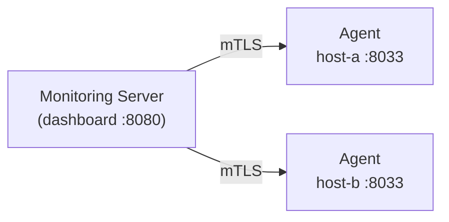

# Church Monitoring

Lightweight monitoring dashboard for church AV infrastructure. A central server pulls status from agents running on each monitored host. Communication is secured with mutual TLS and token-based enrollment.

## Architecture



- **Pull model** — the server fetches status from agents on demand
- **Agents** collect metrics via cron every 5 minutes and cache locally
- **CEC** (TV power/input) checks are triggered from the dashboard, not polled
- **Mutual TLS** — both server and agents present certificates signed by the same CA
- **Token enrollment** — single-use tokens authorize new agents to join

## Prerequisites

- Debian/Ubuntu (tested on Raspberry Pi OS)
- Root access on both server and client machines
- Network connectivity between server and clients

## Server Installation

Run on the machine that will host the monitoring dashboard:

```bash
sudo ./server/install.sh
```

The installer will:

1. Install packages (`apache2`, `openssl`, `jq`)
2. Create a Certificate Authority for mutual TLS
3. Generate a server client certificate
4. Set up the dashboard on port 8080 (configurable with `--port`)
5. Bootstrap the initial admin login account (role-based: user/contributor/admin)
6. Create the enrollment endpoint for client onboarding
7. Generate the first enrollment token

Options:

```
--port NUM      Dashboard port (default: 8080)
--renew-cert    Regenerate the server client certificate only
```

After installation, note the enrollment token printed at the end — you'll need it for each client.

## Client Installation

Run on each machine to be monitored:

```bash
sudo ./client/install.sh
```

You'll be prompted for:

- **Server address** — hostname or IP with port (e.g. `server-ip:8080`)
- **Enrollment token** — the single-use token from the server
- **Client hostname** — defaults to `$(hostname)`
- **Services to monitor** — auto-detected, you confirm each one

The installer will:

1. Install packages (`apache2`, `openssl`, `jq`, `curl`)
2. Generate a TLS certificate and enroll with the server
3. Detect available services and prompt which to monitor
4. Configure Apache on port 8033 with mutual TLS
5. Install status collection scripts and set up a 5-minute cron job

To re-enroll or renew the certificate:

```bash
sudo ./client/install.sh --renew
```

### Monitored Services

The client auto-detects and offers to monitor:

| Service | Type | Description |
|---------|------|-------------|
| apache2 | systemd | Web server |
| church-calendar | systemd | Calendar display server |
| videokiosk2 | systemd | Video kiosk v2 |
| vlc | process | VLC media player |
| midori | process | Midori web browser |
| CEC | on-demand | TV power/input via HDMI-CEC |

## Management Commands

Run these on the **server**:

```bash
# Generate a new enrollment token for another client
sudo ./server/generate-token.sh

# Manually sign a certificate signing request
sudo ./server/sign-csr.sh <path-to-csr>
```

Dashboard user accounts (add/remove, change roles, reset passwords, lock/unlock)
are managed from the dashboard itself, in the admin-only "Manage Users" panel
after logging in at `https://<host>:<port>/login.html` — see
[User Accounts & Roles](#user-accounts--roles) below.

## User Accounts & Roles

The dashboard has its own login screen with per-account sessions and three roles:

| Role | Can do |
|------|--------|
| `user` | Read-only: view status, screenshots, backups, calendar images |
| `contributor` | Everything a `user` can, plus actions: reboot, restart services, CEC control, mode-switch, calendar settings, backup creation, calendar image upload/archive/restore |
| `admin` | Everything a `contributor` can, plus user management: add/remove users, change roles, reset passwords, lock/unlock accounts |

Any logged-in user can change their own password from the dashboard header
(requires the current password). Five consecutive failed login attempts locks
the account out temporarily, with an exponentially increasing wait (30s, 1m,
2m, 4m, ... capped at 30 minutes) for each additional failed attempt — an admin
can also lock/unlock accounts manually at any time. Passwords are stored as
SHA-512 crypt hashes (`openssl passwd -6`), never in the clear.

## File Locations

### Server

| Path | Purpose |
|------|---------|
| `/etc/church-monitoring/` | Configuration root |
| `/etc/church-monitoring/ca/` | CA certificate and key |
| `/etc/church-monitoring/ssl/` | Server client certificate |
| `/etc/church-monitoring/tokens/` | Enrollment tokens |
| `/etc/church-monitoring/users.json` | Dashboard accounts (hashed passwords) |
| `/etc/church-monitoring/sessions/` | Active login sessions |
| `/var/www/church-monitoring/` | Dashboard web root |
| `/usr/lib/cgi-bin/church-monitoring-server/` | Server CGI scripts |

### Client

| Path | Purpose |
|------|---------|
| `/etc/church-monitoring/` | Configuration root |
| `/etc/church-monitoring/ssl/` | Agent certificate and CA cert |
| `/etc/church-monitoring/client-config.json` | Service configuration |
| `/var/cache/church-monitoring/` | Cached status data |
| `/usr/lib/cgi-bin/church-monitoring-client/` | Client CGI scripts |

## Configuration Examples

See `server/config.example.json` and `client/config.example.json` for reference configurations.

## License

MIT
